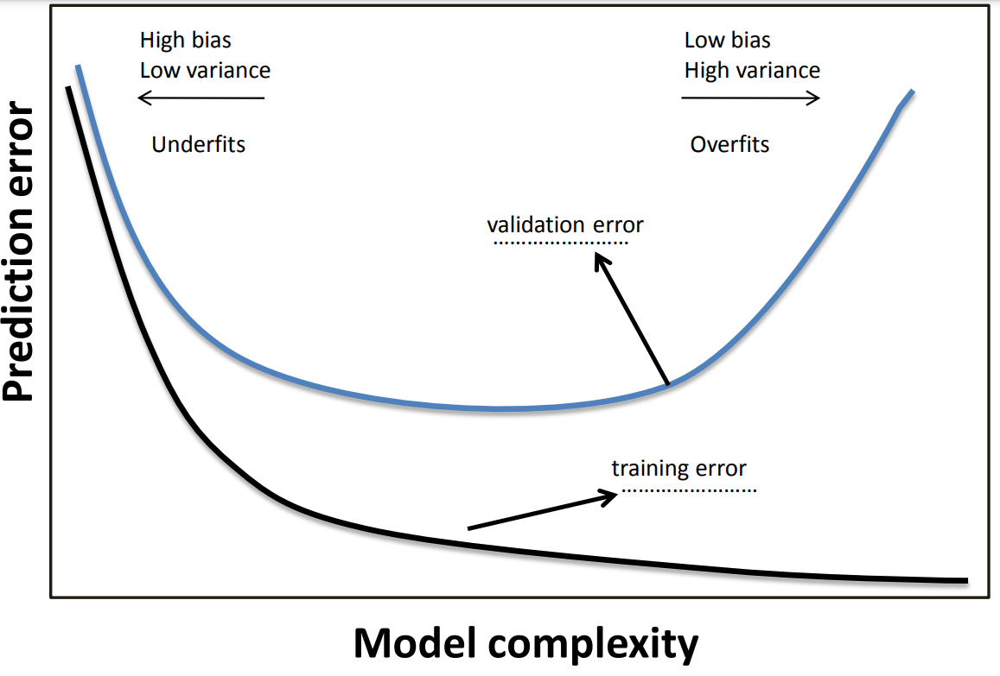

# Advanced Topics Exercises of CMU

## The Fall 2009 10-601 Midterm

### 1. Training and Validation

The following figure depicts training and validation curves of a learner with increasing model complexity

1. Which of the curves is more likely to be the training error and which is more likely to be the validation error? Indicate on the graph by filling the dotted lines.
2. In which regions of the graph are bias and variance low and high? Indicate clearly on the graph with four labels: "low variance", "high variance", "low bias", "high bias".
3. In which regions does the model overfit or underfit? Indicate clearly on the graph by labeling "overfit" and "underfit".

### 2. Bias and Variance

A set of data points is generated by the following process: $Y = w_0 +w_1X +w_2X^2 +w_3X^3 +w_4X^4 + \epsilon$, where X is a real-valued random variable and $\epsilon$ is a Gaussian noise variable. You use two models to fit the data:

**Model 1:** $Y = aX + b + \epsilon$

**Model 2:** $Y = w_0 + w_1X^1 + ... + w_9X^9 + \epsilon$

1. Model 1, when compared to Model 2 using a fixed number of training examples, has a *bias*, which is:
   - [ ] Lower
   - [x] Higher
   - [ ] The Same
2. Model 1, when compared to Model 2 using a fixed number of training examples, has a *variance* which is:
   - [x] Lower
   - [ ] Higher
   - [ ] The Same
3. Given 10 training examples, which model is more likely to overfit the data?
   - [ ] Model 1
   - [x] Model 2

### 3. Controlling Overfitting

We studied a number of methods to control overfitting for various classifiers. Below, we list several classifiers and actions that might affect their bias and variance. Indicate (by circling) how the bias and variance change in response to the action:

1. Reduce the number of leaves in a decision tree:

   | Bias             | Variance         |
   | ---------------- | ---------------- |
   | Decrease         | Decrease [**X**] |
   | Increase [**X**] | Increase         |
   | No Change        | No Change        |

2. Increase *k* in a *k-nearest neighbor* classifier:

   | Bias             | Variance         |
   | ---------------- | ---------------- |
   | Decrease         | Decrease [**X**] |
   | Increase [**X**] | Increase         |
   | No Change        | No Change        |

3. Increase the number of training examples in logistic regression:

   | Bias              | Variance         |
   | ----------------- | ---------------- |
   | Decrease          | Decrease [**X**] |
   | Increase          | Increase         |
   | No Change [**X**] | No Change        |