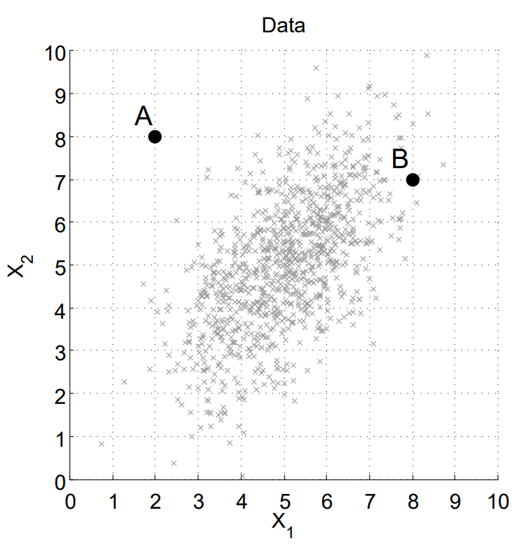
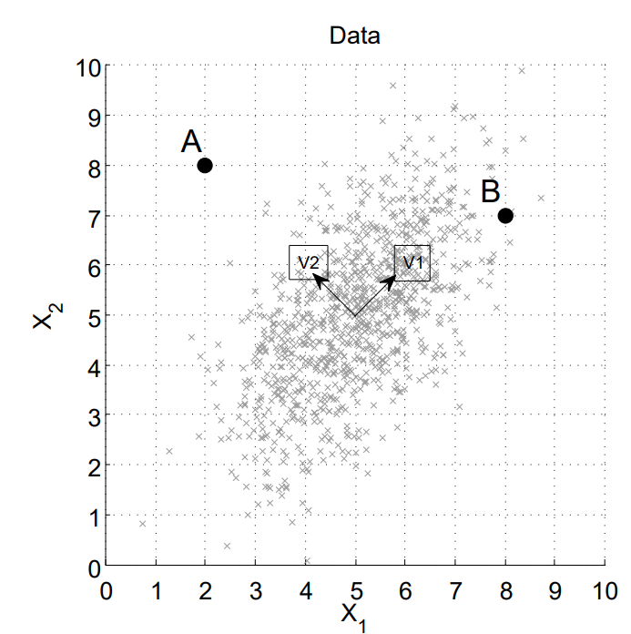

# Unsupervised Exercises of CMU

## The Fall 2009 10-601 Midterm

### 1. Principal Component Analysis

Plotted in the next figure are two dimensional data drawn from a multivariate Normal (Gaussian) distribution.

#### 1.1 The Multivariate Gaussian

1. What is the mean of this distribution? Estimate the answer visually and round to the nearest integer.

   ​	$$ E[X_1] = \mu_1 = 5 $$

   ​	$$ E[X_2] = \mu_2 = 5 $$

2. Would the off-diagonal covariance $\sum_{1,2} = Cov (X_1, X_2)$ be:
   - [ ] negative
   - [x] positive
   - [ ] approximately zero

#### 1.2 Principal Component Analysis

Define $v_1$ and $v_2$ as the directions of the first and second principal component, with $|||v_1|| = ||v_2|| = 1$. These directions define a change of basis

$$Z_1 = (X - \mu)\cdot v_1$$

$$Z_2 = (X - \mu)\cdot v_2$$

1. Sketch and label $v_1$ and $v_2$ on the following figure (a copy of the previous figure). The arrows should originate from the mean of the distribution. You do not need to solve the SVD, instead visually estimate the directions.

   

2. The covariance $Cov(Z_1, Z_2)$, is (circle):
   - [ ] negative
   - [ ] positive
   - [x] approximately zero
3. Which point (A or B) would have the higher reconstruction error after projecting onto the first principal component direction $v_1$? Circle one:
   - [x] Point A
   - [ ] Point B

## The 2004 10-701 midterm

### 1. K-Means and Hierarchical Clustering

1. Perform K-means on the dataset given below. Circles are data points and there are two initial cluster centers, at data points 5 and 7. Draw the cluster centers (as squares) and the decision boundaries that define each cluster. If no points belong to a particular cluster, assume its center does not change. Use as many of the pictures as you need for convergence.

   

   2. Give one advantage of hierarchical clustering over K-means clustering, and one advantage of K-means over hierarchical clustering.

      *Some advantages of hierarchical clustering:*

      - *Don't need to know hoy many clusters you're after*
      - *Can cut hierarchy at any level to get any number of clusters*
      - *Easy to interpret hierarchy for particular applications*
      - *Can deal with long stringy data*

      *Some advantages of K-means clustering:*

      - *Can be much faster than hierarchical clustering, depending on data*
      - *Nice theoretical framework*
      - *Can incorporate new data and reform clusters easily*

## The 2001 final

### 1. Clustering

In the left of the following pictures I show a dataset. In the right figure I sketch the globally maximally likely mixture of three Gaussians for the given data.

- Assume we have a protective code in place that prevents any degenerate solutions in which some Gaussian grows infinitesimally small.
- Assume a GMM model in which all parameters (class probabilities, class centroids and class covariances) can be varied.

1. Using the same notation and the same assumptions, sketch the globally maximally likely mixture of **two** Gaussians.

2. Using the same notation and the same assumptions, sketch a mixture of three distinct Gaussians that is stuck in a suboptimal configuration (i.e. in which infinitely many more interations of the EM algorithm would remain in essentially the same suboptimal configuration). (*You must not give an answer in which two or more Gaussians all have the same mean vectors --we are looking for an answer in which all Gaussians have distinct mean vectors*)

   

3. Using the same notation and the same assumptions, sketch the globally maximally likely mixture of two Gaussians in the following new, dataset.

   

4. Now, suppose we ran k-means with $k=2$ on this dataset. Show the rough locations of the centers of the two clusters in the configuration with globally minimal distortion

   

## The 2002 final

### 1. K-means and Gaussian Mixture Models

1. What is the effect on the means found by k-means (as opposed to the true means) of overlapping clusters?

   *They are pushed further apart than the true means would be.*

2. Run k-means manually for the following dataset. Circles are data points and squares are the initial cluster centers. Draw cluster centers and the decision boundaries that define each cluster. Use as many pictures as you need until convergence.

   **Note:** Execute the algorithm such that if a mean has no points assigned to it, it says where it is for that iteration.

   

3. Now draw (approximately) what a Gaussian mixture model of three gaussians with the same initial centers as for the k-means problem would converge to. Assume that the model puts no restrictions on the form of the covariance matrices and that EM updates both the means and covariance matrices

   

   4. Is the classification given by the mixture model the same as the classification given by k-means? Why or why not?

      *I'd answer if I knew the start locations.*

## The 2003 final

### 1. GMM

Consider the  classification problem illustrated in the following figure. The data points in the figure are labeled, where "o"  corresponds to  class 0 and "+"  corresponds to class 1. We now estimate a GMM  consisting of 2 Gaussians, one Gaussian per  class, with the constraint that the  covariance matrices are identity matrices. The mixing proportions (class frequencies) and the means of the two Gaussians are free parameters.

1. Plot the maximum likelihood estimates of the means of the two Gaussians in the figure. Mark the means as points "x" and label them "0" and "1" according to class.

   *The means of the two Gaussians should be close to the center of mass of points*

   

2. Based on the learned GMM, what is the probability of generating a new data point that belongs to  class 0?

   *0.5*

3.  How many data points are classified *incorrectly*?

   *3*

4. Draw the decision boundary in the same figure.

   *Since the two classes have the same number of points and identical covariance matrices, the decision boundary should be a straight line, which is also the orthogonal bisector of the line segment connecting the class means*

### 2. K-means Clustering

There is a set S consisting of 6 points in the plane shown as below, $a = (0, 0)$, $b = (8, 0)$, $c = (16, 0)$, $d = (0, 6)$, $e = (8, 6)$, $f = (16, 6)$. Now we run the k-means algorithm on those points with $k = 3$. The algorithm uses the Euclidean distance metric (i.e. the straight line distance between two points) to assign each point to its nearest centroid. Ties are broken in favor of the centroid to the left/down. Two definitions:

- A ***k*-starting configuration** is a subset of *k* starting points from *S* that form the initial centroids, e.g. {a, b, c}.
- A ***k*-partition** is a partition of *S* into *k* non-empty subsets, e.g. {a, b, e}, {c, d}, {f} is a 3-partition.

Clearly any *k*-partition induces a set of *k* centroids in the natural manner. A *k*-partition is called *stable* if a repetition of the *k*-means iteration with the induced centroids leaves it unchanged.

1. How many 3-starting configurations are there? (Remember, a 3-starting configuration is just a subset, of size 3, of the six datapoints).

   *$C^3_6 = 20$*

2. Fill in the following table:

   | 3-partition            | Stable? | An example 3-starting configuration that can arrive at the 3-partition after 0 or more iterations | \# of unique 3-starting configurations that arrive at the 3-partition |
   | ---------------------- | ------- | ------------------------------------------------------------ | ------------------------------------------------------------ |
   | {a, b, e}, {c,d}, {f}  | *N*     | *none*                                                       | *0*                                                          |
   | {a, b}, {d, e}, {c, f} | *Y*     | *{b,c,e}*                                                    | *4*                                                          |
   | {a, d}, {b, e}, {c, f} | *Y*     | *{a,b,c}*                                                    | *8*                                                          |
   | {a}, {d}, {b,c,e,f}    | *Y*     | *none*                                                       | *0*                                                          |
   | {a,b,d},{c},{e,f}      | *Y*     | *{a,c,f}*                                                    | *1*                                                          |

### The 2004 final

#### 1. Learning from labeled and unlabeled data

Consider the following figure which contains labeled (class 1 black circles class 2 hollow circles) and unlabeled (squares) data. We would like to use two methods discussed in class (re-weighting and co-training) in order to utilize the unlabeled data when training a Gaussian classifier.

1. How can we use co-training in this case (what are the two classifiers) ?

   *Co-training partitions the feature space into two separate sets and uses these sets to construct independent classifiers. Here, the most natural way is to use one classifier (a Gaussian) for the x axis and the second (another Gaussian) using the y axis.*

2. We would like to use re-weighting of unlabeled data to improve the classification performance. Reweighting will be done by placing a the dashed circle on each of the labeled data points and counting the number of unlabeled data points in that circle. Next, a Gaussian classifier is run with the new weights computed.

   

   1. To what class (hollow circles or full circles) would we assign the unlabeled point A is we were training a Gaussian classifier using only the labeled data points (with no re-weighting)?

      *Hollow class. Note that the hollow points are much more spread out and so the Gaussian learned for them will have a higher variance.*

   2. To what class (hollow circles or full circles) would we assign the unlabeled point A is we were training a classifier using the re-weighting procedure described above?

      *Again, the hollow class. Re-weighting will not change the result since it will be done independently for each of the two classes, and will produce very similar class centers to the ones in 1 above.*

   3. When we handle a polynomial regression problem, we would like to decide what degree of polynomial to use in order to fit a test set. The table below describes the dis-agreement between the different polynomials on unlabeled data and also the disagreement with the labeled data. Based on the method presented in class, which polynomial should we chose for this data? **Which of the two tables do you prefer?**

      | Disagreement on unlabled data |       |       |       |       |       | Disagreement on training data |
      | :---------------------------- | :---: | :---: | :---: | :---: | :---: | :---------------------------: |
      | **Degree**                    | **1** | **2** | **3** | **4** | **5** |                               |
      | 1                             |   0   |  0.3  |  0.5  |  0.6  |  0.7  |              0.4              |
      | 2                             |       |   0   |  0.2  |  0.4  |  0.5  |              0.2              |
      | 3                             |       |       |   0   |  0.2  |  0.5  |              0.1              |
      | 4                             |       |       |       |   0   |  0.3  |               0               |
      | 5                             |       |       |       |       |   0   |               0               |

      *The degree we would select is 3. Based on the classification accuracy, it is beneficial to use higher degree polynomials. However, as we said in class these might overfit. One way to test if they do or don’t is to check consistency on unlabeled data by requiring that the triangle inequality will hold for the selected degree. For a third degree this is indeed the case since* $u(2, 3) = 0.2 \leq l(2) + l(3) = 0.2 + 0.1$ *(where* $u(2, 3)$ *is the disagreement between the second and third degree polynomials on the unlabeled data and* $l(2)$ *is the disagreement between degree 2 in the labeled data). Similarly,* $u(1, 3) = 0.5 \leq l(1) + l(3) = 0.4 + 0.1$. In contrast, this does not hold for a fourth degree polynomial since $u(3, 4) = 0.2 > l(3) + l(4) = 0.1$.

## The 2006 Final

### 1. Dimensionality Reduction

In this problem four linear dimensionality reduction methods will be discussed. They are principal component analysis (PCA), linear discriminant analysis (LDA), canonical correlation analysis (CCA), non-negative matrix factorization (NMF).

1.  LDA reduces the dimensionality given labels by *maximizing the overall interclass variance relative to intraclass variance*. Plot the directions of the first PCA and LDA components in the following figures respectively.

   

   

2.  In practice, each data point may have multiple vector-valued properties, e.g. a gene has its expression levels as well as the position on the genome. The goal of CCA is to reduce the dimensionality of the properties jointly. Suppose we have data points with two properties x and y, each of which is a 2-dimension vector. This 4-dimensional data is shown in the pair of figures below; different data points are shown in different gray scales. CCA finds $(u, v)$ to maximize the correlation $\hat{corr}(u^Tx)(v^Ty)$. In figure 2(b) we have given the direction of vector v, plot the vector u in figure 2(a).

   

3. The goal of NMF is to reduce the dimensionality given non-negativity constraints. That is, we would like to find principle components $u_1,..., u_r$, each of which is of dimension $d > r$, such that the d-dimensional data $x \approx \sum^r_{i=1} z_iu_i$, and all entries in $x$, $z$, $u_{1:r}$ are nonnegative. NMF tends to find sparse (usually small L1 norm) basis vectors $u_i's$ . Below is an example of applying PCA and NMF on a face image. Please point out the basis vectors in the equations and give them correct labels (NMF or PCA).

   

### 2. Graph-Theoretic Clustering

#### Part A. Min-Cut and Normalized Cut

In this problem, we consider the 2-clustering problem, in which we have $N$ data points $x_{1:N}$ to be grouped in two clusters, denoted by $A$ and $B$. Given the $N$ by $N$ affinity matrix $W$,

- Min-Cut: minimizes $\sum_{i\in A} \sum_{j\in B} W_{ij}$;
- Normalized Cut: minimizes $\dfrac{\sum_{i\in A}\sum_{j\in B}W_{ij}}{\sum_{i\in A}\sum_{j=1}^N W_{ij}} + \dfrac{\sum_{i\in A}\sum_{j\in B}W_{ij}}{\sum_{i=1}^N\sum_{j\in B} W_{ij}}$

1. The data points are shown in Figure (A1) above. The grid unit is 1. Let $W_{ij} = e^{−||x_i−x_j||^2_2}$, give the clustering results of min-cut and normalized cut respectively (You may show your work in the figure directly).
2. The data points are shown in Figure (A2) above. The grid unit is 1. Let $W_{ij} = e^{\dfrac{−||x_i−x_j||^2_2}{2\sigma^2}}$, describe the clustering results of min-cut algorithm for $\sigma^2 = 50$ and $\sigma^2 = 0.5$ respectively.